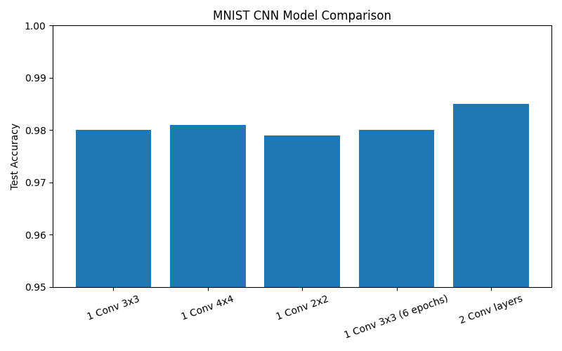

# MNIST Digit Classification using CNN

This project implements a Convolutional Neural Network (CNN) using TensorFlow/Keras to classify handwritten digits from the MNIST dataset.  
Multiple CNN configurations were tested to study the effects of kernel size, model depth, pooling, and training epochs on classification accuracy.

---

## Requirements

- Python 3.9+ (Python 3.11 recommended)  
- TensorFlow ≥ 2.15  
- NumPy  
- Matplotlib

Install dependencies:

pip install -r requirements.txt

---

## Data Preprocessing

- Pixel values are normalized from [0–255] to [0–1].
- No resizing or augmentation was applied since MNIST is already standardized.

---

## Model Architectures

### 1) Shallow CNN

Input (28×28)  
→ Reshape (28×28×1)  
→ Conv2D  
→ Flatten  
→ Dense(10, Softmax)

---

### 2) Deeper CNN (Best Performing)

Input (28×28)  
→ Reshape  
→ Conv2D(16, 3×3)  
→ Conv2D(32, 3×3)  
→ Flatten  
→ Dense(10, Softmax)

---

## Experimental Results

| Model Variant | Architecture | Epochs | Approx Training Time | Test Accuracy |
|----------------|----------------|--------|------------------------|----------------|
| Single Conv (3×3) | Conv2D(16, 3×3) → Flatten | 3 | ~10 s | 0.980 |
| Single Conv (4×4) | Conv2D(16, 4×4) → Flatten | 3 | ~11 s | 0.981 |
| Single Conv (2×2) | Conv2D(16, 2×2) → Flatten | 3 | ~9 s | 0.979 |
| Single Conv (3×3) – 6 Epochs | Conv2D(16, 3×3) → Flatten | 6 | ~18 s | 0.980 |
| Two Convolution Layers (Best) | Conv2D(16, 3×3) → Conv2D(32, 3×3) → Flatten | 6 | ~22 s | 0.985 |

---

## Accuracy Comparison

---

## Key Observations

- Deeper CNNs outperform wider kernels alone. Adding an extra convolution layer provided the largest accuracy improvement.
- Smaller kernels (2×2) underperformed due to limited spatial context.
- Pooling layers were avoided to preserve fine spatial digit details.
- Increasing epochs beyond convergence gave minimal performance improvements.

---

## Limitations

- MNIST is a simple dataset — results may not generalize to complex image classification tasks.
- No data augmentation or regularization techniques were used.
- Training was done on CPU only.

---

## How To Run

Train the CNN:

python train_mnist.py

Generate the accuracy comparison graph:

python plot_results.py

---

## Author

Sanjita Bhaavya Ganesh  
https://github.com/sanjitaganesh
